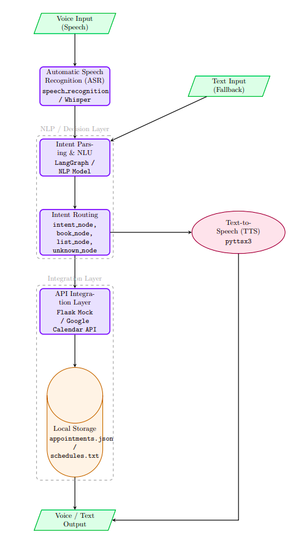

# Voice Automation Agent

A **voice-driven scheduling assistant** that can  **book** ,  **list** , and **manage appointments** through natural voice commands.

It integrates  **speech recognition** ,  **text-to-speech (TTS)** , and a **mock API** for appointment handling.

---

## Features

**- Voice Interaction** 
      - Speak commands like “Book a meeting” or “List my appointments.”

**- Text Fallback** 
    – Automatically switches to text input if microphone or speech fails.

- **Appointment Management**
  - Create, list, and store appointments locally (JSON & Markdown).
- **Conflict Detection**
  - Prevents overlapping bookings.
- **Mock API Integration**
  - Simulates cloud scheduling APIs via Flask.
- **Persistent Storage**
  - Saves all appointments locally for later retrieval.

---

## Project Structure

```
voice-automation-agent/
│
├── main.py             # Entry point and conversation controller
├── nodes.py            # Intent detection and dialogue flow
├── scheduler.py        # Appointment creation, listing, and storage
├── speech_utils.py     # Voice input/output handling
├── mock_api.py         # Local Flask mock API server
│
├── appointments.json   # Local saved appointments (auto-created)
├── appointments.md     # Markdown log of all appointments (auto-created)
│
└── requirements.txt    # Dependencies
```

---

## Installation

### 1. Clone the repository

```bash
git clone https://github.com/ahmedanwar123/appointments-voice-agent.git
cd appointments-voice-agent
```

### 2. Create and activate a virtual environment

```bash
python3 -m venv agent_venv
source venv/bin/activate
```

### 3. Install dependencies

```bash
pip install -r requirements.txt
```

---

## How to Run

### 1. Start the Mock API

In a separate terminal:

```bash
python3 mock_api.py
```

You should see:

```
 * Running on http://127.0.0.1:5000
```

### 2. Run the Voice Assistant

```bash
python3 main.py
```

If you don’t have a microphone or prefer typing, force text mode:

```bash
FORCE_TEXT_INPUT=1 python3 main.py
```

---

## Example Interaction

```
Agent: Hello! I am your voice assistant. You can book or list appointments.
Agent: What would you like to do?
User: Book an appointment.
Agent: Sure — what's the title?
User: Dentist visit.
Agent: On which day?
User: Next Monday.
Agent: What time?
User: 3 PM.
Agent: How long? (say default for 60)
User: Default.
Agent: Confirm create 'Dentist visit' on Monday at 3 PM?
User: Yes.
Agent: Appointment 'Dentist visit' created for Monday at 3 PM.
```

---

## Data Storage

| File                  | Purpose                                         |
| --------------------- | ----------------------------------------------- |
| `appointments.json` | Structured storage of all scheduled events      |
| `appointments.md`   | Human-readable log with timestamps and metadata |

Each new booking is appended to both files.

---

## API Details

**Base URL:** `http://127.0.0.1:5000`

### Endpoints

| Method   | Endpoint          | Description            |
| -------- | ----------------- | ---------------------- |
| `GET`  | `/health`       | Check API status       |
| `POST` | `/appointments` | Create new appointment |

Example `POST` payload:

```json
{
  "title": "Dentist visit",
  "start": "2025-11-05T15:00:00",
  "end": "2025-11-05T16:00:00",
  "location": "Dr Mohamed's Clinic"
}
```

---


## 🧠 Architecture Overview

Below is the conceptual architecture showing how the **Voice Automation Agent** interacts with different components such as the  **speech utilities** ,  **nodes** ,  **scheduler** , and  **mock API** .



```
User (Voice/Text)
        │
        ▼
 [speech_utils.py]  ←→  Microphone + Speaker
        │
        ▼
 [main.py] → [nodes.py] → [scheduler.py]
                          │
                          ├── Local Files (.json, .md)
                          └── mock_api.py (Flask)
```


## Environment Variables

| Variable             | Description                      | Default                   |
| -------------------- | -------------------------------- | ------------------------- |
| `FORCE_TEXT_INPUT` | Force text mode instead of voice | `0`                     |
| `USE_REMOTE_API`   | Enable/disable API calls         | `1`                     |
| `API_BASE`         | API base URL                     | `http://127.0.0.1:5000` |

---

## Testing

Try listing or booking via both voice and text:

```bash
python3 main.py
```

Examples:

* “List my appointments.”
* “Book a meeting tomorrow at 5 PM.”
* “Exit.”

---

## Author

**Ahmed Anwar Gad**

CSE Senior - E-JUST

ahmed.anwar2003@gmail.com
